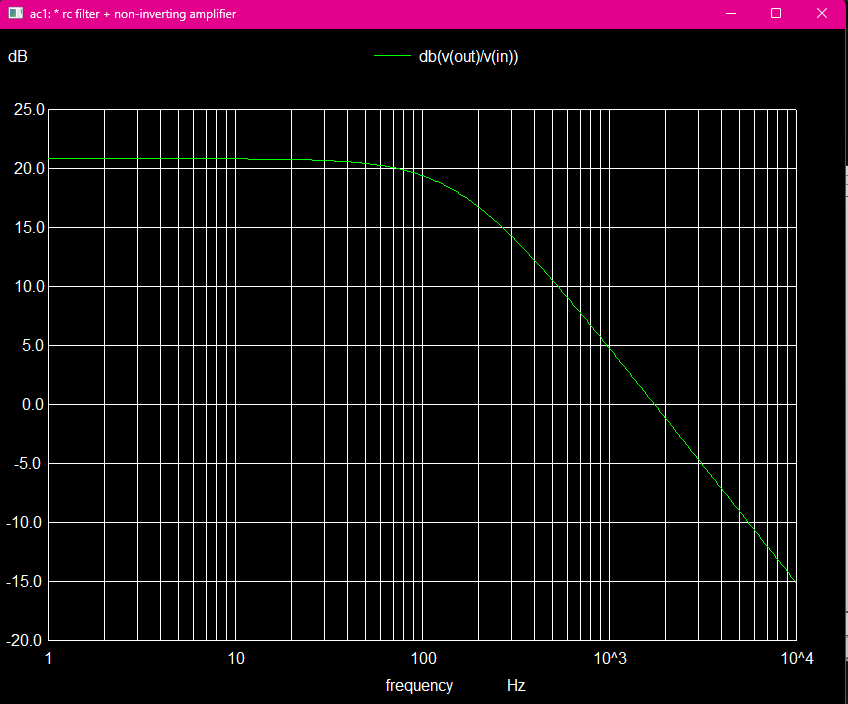
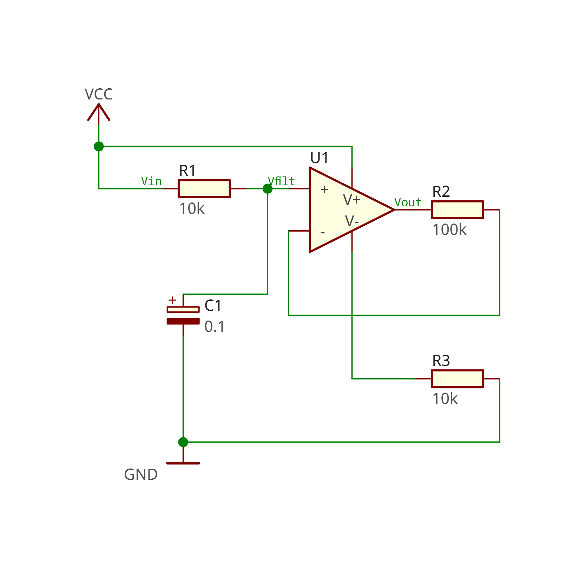

# RC Filter + Op-Amp Signal Conditioning

## Overview
Designed a basic analog signal-conditioning circuit using a first-order RC low-pass filter and a non-inverting op-amp amplifier.

## Schematic

## Simulation Result

## Tools
- LibrePCB
- Ngspice

## Circuit
- R1 = 10kΩ
- C1 = 0.1µF
- R2 = 100kΩ
- R3 = 10kΩ

## Results
AC simulation shows:
- theoretical RC cutoff ≈ 159 Hz
- AC simulation confirms roll-off beginning near the expected cutoff
- passband gain ≈ 20 dB (~11×)
- attenuation of higher-frequency noise

## Files
- `schematic.png`
- `schematic.pdf`
- `response.png`
- `rc_opamp.cir`

## Why This Project Matters
This project demonstrates a complete beginner-to-intermediate analog design workflow:
- schematic capture in LibrePCB
- component selection from design targets
- AC simulation in Ngspice
- interpretation of gain and cutoff behavior

This type of front-end is commonly used in sensor preprocessing before embedded ADC acquisition.
